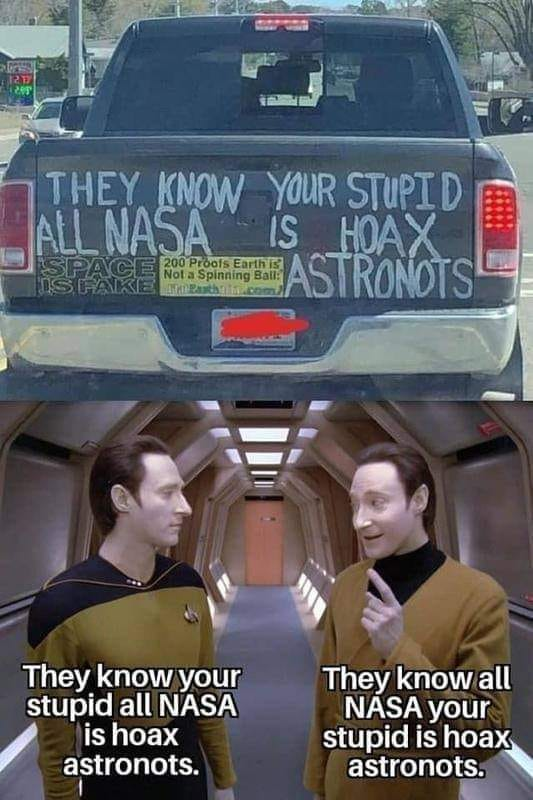

# Using computers to decipher mysteries of the redneck wisdom

> **The medium is the message**
> 
> *- Marshall McLuhan, Canadian media theorist and philosopher*

For the benefit of the community and in an attempt to preserve the sanity of those, who have stumbled on the social media post with the mysterious writings on the back of the track (Marshall McLuhan's idea is most suitable here, even if to the totally surprising twist to the truthiness for some Media Studies scholars such as yours truly), I have decided to make a basic script to find any possible meaning of that phrase

Having run the program, I have discovered **362'880** possible permutations for the wordsalad on the back of that truck. Cursory observation of the text has not yielded any meanings possible meanings, aside from the indication that whoever wrote this may have some sort of mental deficiency and most definitely complete lack of education.
